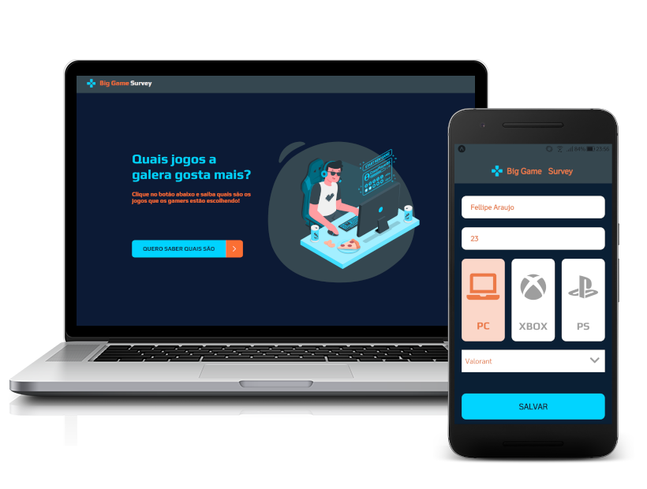

<h1 align="center">
  
</h1>

  

## :computer: Projeto

Aplicação Web e Mobile desenvolvida durante a Semana Dev Superior 1.0. Este projeto tem o intuito de coletar a opinião dos jogadores sobre qual o jogo que eles mais gostam, informando o nome do jogo, gênero e plataforma (PlayStation, XBOX ou PC). É mostrado um resumo em gráficos dos jogos, gêneros e plataformas mais jogadas, além dos dados de quem participou da pesquisa.

## :zap: Tecnologias

* Java
* ReactJS
* React Native
* TypeScript

## :heavy_check_mark: Aplicação FullStack Completa

* Backend
* Front-Web
* Front-Mobile
